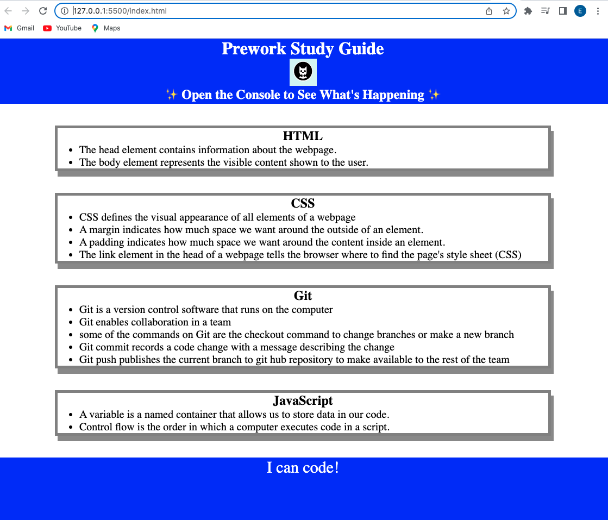

# Pre-work Study Guide Webpage

## Description

I made this project to organize notes of what i learned in the pre-work.
Making this project introduced me to HTML, CSS, Git and Javascript
and how they are used to create a complete web page.

## Installation

### Tools you will need

- git
- github access
- VS Code
- web browser 

### Steps

- clone this repository
- open VS Code to edit contents

## Usage

Open your web browser on the index.html file in the project.

Screenshot:

The study guide presents my notes on the four pre-work topics: 
HTML, JavaScript, CSS and Git. To demonstrate javaScript code, the page will print these topics to the browser console (view in developer tools). As an extra feature, 
the javaScript code will suggest a random topic and print it to console as well.

## Credits

I followed the tutorial provided by bootcamp pre-work.

## License

For my license, see the file `LICENSE`.

## Badges

